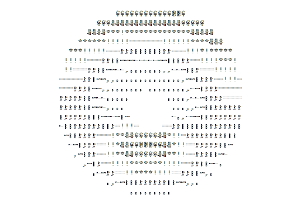

<div align="center">


</div>

<br/>


## `whoami`

```js
const manan = {
  institution : "Chitkara University, Rajpura",
  degree      : "B.Tech CSE — Semester 2",
  timezone    : "IST (UTC +5:30) · Night Owl 🦉",
  grinding    : ["DSA", "C++", "JavaScript", "The Odin Project"],
  target      : "FAANG SDE — earning it one commit at a time",
  debugStyle  : "console.log() + blind faith + sheer stubbornness",
};
```

<br clear="right"/>

---

## ⚡ What I'm Up To

- 🧠 &nbsp; Grinding **DSA** with Striver's A2Z sheet — 0 shortcuts taken
- 🌐 &nbsp; Building real projects through **The Odin Project** curriculum
- ⚔️ &nbsp; Learning **C++** for competitive programming foundations
- 🎯 &nbsp; Long game: **FAANG SDE** via demonstrated skill, not college brand
- 📖 &nbsp; Currently in: *Arrays → Sorting → Recursion* territory

---

## 🛠 Tech Stack

<p align="left">
  
</p>

**Comfortable with:** HTML · CSS · JavaScript · C · C++ · Python · Git  
**Currently deepening:** DSA with C++ · DOM manipulation · Responsive layouts

---

## 🚀 Projects

| Project | What it does | Stack |
|---|---|---|
| **[Rock Paper Scissors](https://rock-paper-scissor-game-zeta-one.vercel.app/)** | Interactive web game — DOM manipulation & state management | JS · HTML · CSS |
| **[Odin Landing Page](https://mananbdev.github.io/odin-landing-page/)** | Fully responsive page built from a design mockup | CSS Flexbox |
| **[Odin Recipes](https://mananbdev.github.io/odin-recipes/)** | Multi-page recipe directory — HTML fundamentals | HTML |
| **💱 Currency Converter** | Core engine built from scratch — AI used only for UI mockup ideation | JS |

---

## 📊 GitHub Stats

<p align="center">
  
  
</p>

<p align="center">
  
</p>

---

## ⏱ WakaTime — This Week

<!--START_SECTION:waka-->


```text
CSS          3 hrs 5 mins    ████████░░░░░░░░░░   34.69%
JavaScript   3 hrs 2 mins    ████████░░░░░░░░░░   34.21%
HTML         2 hrs 37 mins   ███████░░░░░░░░░░░   29.49%
C            7 mins          ░░░░░░░░░░░░░░░░░░    1.47%
```

🦉 Night owl confirmed — **69% of commits happen in the evening.**  
📅 Most productive day: **Monday** (there's a pattern here)

<!--END_SECTION:waka-->

---

## 🗺 The Roadmap

```
[Sem 1-2] ──► HTML/CSS/JS basics          ✅ Done
[Sem 2]   ──► DSA foundations (C++)       🔄 In progress
[Sem 3-4] ──► Core DSA + CP start         📌 Next
[Sem 5-6] ──► System Design + Projects    📌 Planned
[Sem 7-8] ──► Internship grind + FAANG    🎯 Target
```

---

## 🤝 Connect

<p align="left">
  <a href="https://github.com/mananbdev">
    
  </a>
  <a href="https://www.linkedin.com/in/manan-bansal-724848381/">
    
  </a>
  <a href="mailto:mananbansal583@gmail.com">
    
  </a>
</p>

---

<div align="center">



**172 contributions in 2026 and counting.  
The best commit is the next one. 🚀**


</div>
